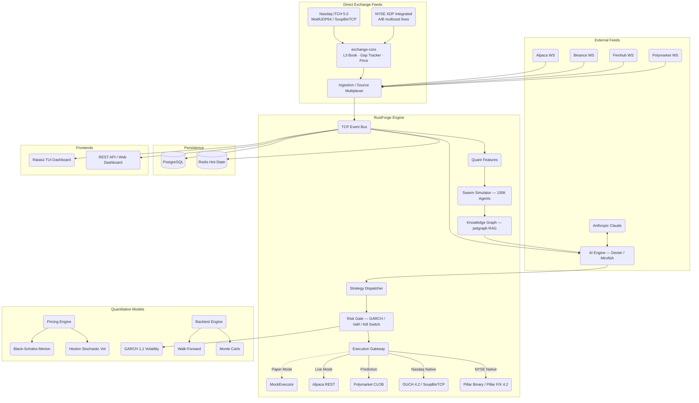

# RustFinance Terminal (rust-finance)

<div align="center">
  
  
  
  
  
  <br />
  
  
  
  
  
  <br />
  
  
  
  
  
  <br />
  <a href="https://github.com/Ashutosh0x/rust-finance/stargazers"></a>
  <a href="https://github.com/Ashutosh0x/rust-finance/network/members"></a>
  <a href="https://buymeacoffee.com/Ashutosh0x"></a>
  <br />
  
  
  
  
  <br />
  
  
  
  
  
  
  
  <br />
  
  
  
  
  <br />
  
  
  
  
  
  <br />
  
  
  
  <br />
  <a href="https://scorecard.dev/viewer/?uri=github.com/Ashutosh0x/rust-finance"></a>
  <a href="https://github.com/Ashutosh0x/rust-finance/actions/workflows/security.yml"></a>
  <a href="https://github.com/Ashutosh0x/rust-finance/actions/workflows/test.yml"></a>
  <a href="https://deps.rs/repo/github/Ashutosh0x/rust-finance"></a>
  <a href="https://opensource.org/licenses/MIT"></a>
</div>

---

## At a Glance

RustFinance Terminal, also called RustForge, is an open-source Rust trading terminal for market-data ingestion, execution research, quantitative risk controls, compliance checks, and terminal dashboards.

- **Try it locally:** `cargo run -p tui --release`
- **Run the daemon:** `USE_MOCK=1 cargo run -p daemon --release`
- **Demo:** https://github.com/user-attachments/assets/c769b2c2-cfa0-44bd-a261-99786ea653e1
- **Community:** [Roadmap](ROADMAP.md), [Contributing](CONTRIBUTING.md), [good first issues](https://github.com/Ashutosh0x/rust-finance/issues?q=is%3Aissue+is%3Aopen+label%3A%22good+first+issue%22)
- **Direct exchange connectivity:** [Nasdaq ITCH/OUCH + NYSE Pillar](docs/DIRECT_EXCHANGE_CONNECTIVITY.md) — native binary protocols, 294 tests
- **Research Paper:** [📄 RustFinance Research Paper 2026 (PDF)](rustfinance.pdf) — 1,400+ line LaTeX paper covering architecture, 18 research papers, quantitative models, and benchmarks
- **Funding:** [GitHub Sponsors](https://github.com/sponsors/Ashutosh0x), [Buy Me a Coffee](https://buymeacoffee.com/Ashutosh0x), [funding.json](funding.json)
- **Recognition:** [Listed in awesome-rust Finance applications](https://github.com/rust-unofficial/awesome-rust/pull/2447)

> Safety: this project is research and open-source infrastructure. It is not financial advice, not a broker, and not a guarantee of live-trading readiness. Use paper trading and independent review before connecting real capital.

---

## Overview


https://github.com/user-attachments/assets/c769b2c2-cfa0-44bd-a261-99786ea653e1


RustForge is an institutional-grade AI trading terminal built in pure Rust. It combines real-time multi-exchange market data, Claude-powered AI analysis, quantitative risk management, prediction market trading, and a full TUI dashboard — all in a single binary with nanosecond-precision timestamps and sub-millisecond latency.

> **v0.4** — 2026 Quant Alpha Library: Multi-level Microprice (MLOFI), Adverse Selection Detection, Regime-Conditioned Quoting, Kelly+Bayesian Sizing, Alpha Health Monitor, IC-Weighted Composite Signals, Enhanced Avellaneda-Stoikov Quoting Engine, Almgren-Chriss Optimal Execution, Live Binance WebSocket Candlestick Feed, and WebSocket Gap Detection Engine. 82+ unit tests passing on Rust 1.95.0.

| Feature | Detail |
|:---|:---|
| Language | Pure Rust |
| Interface | Full TUI Dashboard (Ratatui, 6 screens) |
| AI Integration | Claude-powered Dexter Analyst |
| Execution Algorithms | TWAP, VWAP, Iceberg, POV, Almgren-Chriss Optimal Execution |
| Market Making | Enhanced Avellaneda-Stoikov with regime gating, VPIN toxicity, OFI skew |
| Microstructure | Multi-level MLOFI, OFI, Microprice, Kyle's Lambda, VPIN, Amihud, Lee-Ready |
| Smart Order Router | Multi-venue scoring (fill rate, latency, fees, impact) |
| Alpha Signals | Toxicity detection, regime classifier, IC-weighted composite, alpha health |
| Position Sizing | Quarter-Kelly with Bayesian shrinkage, conviction scaling |
| Live Data | Binance WebSocket candlestick feed with gap detection engine |
| Prediction Markets | Polymarket CLOB + cross-platform arbitrage engine |
| Agent Simulation | 100K-agent Rayon-parallel swarm |
| Knowledge Graph | petgraph-backed RAG engine |
| Risk Models | GARCH(1,1) + VaR + Kill Switch + SMP + Regime Detection + Toxicity Gating |
| Timestamp Precision | Nanosecond (`UnixNanos`) |
| Deterministic Replay | `DeterministicClock` + `SequenceId` ordering |
| Regulatory Compliance | SEBI 2026 Algo-ID + OPS threshold + pre-trade checks |
| Fill Simulation | Almgren-Chriss √-impact model + fixed slippage |
| Alpha Monitoring | Rolling IC, Sharpe, hit rate with auto-decay detection |
| FIX Protocol | Production FIX 4.4 parser + NYSE Pillar FIX 4.2 profile |
| Direct Feeds | Nasdaq TotalView-ITCH 5.0 (MoldUDP64/SoupBinTCP), NYSE XDP Integrated (A/B multicast) |
| Native Order Entry | Nasdaq OUCH 4.2, NYSE Pillar Binary Gateway, NYSE Pillar FIX 4.2 |
| Order Book | Level 3 order-by-order, exact integer prices (1e-9 USD), venue-neutral |
| Feed Recovery | MoldUDP64 re-request, Pillar retransmit + refresh, A/B line arbitration, GLIMPSE |
| Market Sources | Nasdaq ITCH, NYSE XDP, Alpaca, Binance, Finnhub, Polymarket, Mock |
| Execution | Nasdaq OUCH, NYSE Pillar (binary + FIX), Alpaca REST, Polymarket CLOB, Paper Trading |
| License | MIT |


---

## Table of Contents
- [Overview](#overview)
- [Architecture](#architecture)
- [Direct Exchange Connectivity](#direct-exchange-connectivity-nasdaq--nyse)
- [Quick Start](#quick-start)
- [Roadmap](ROADMAP.md)
- [Contributing](CONTRIBUTING.md)
- [Features](#features)
- [TUI Hotkeys](#tui-hotkeys)
- [Performance](#performance)
- [Configuration](#configuration)
- [Strategy Development](#strategy-development)
- [API Reference](#api-reference)
- [Troubleshooting](#troubleshooting)
- [License and Disclaimer](#license-and-disclaimer)

---

## Architecture

38 modular crates, 260+ source files, strict dependency boundaries.



### Crate Map

```
common           Nanosecond timestamps, events, config, models
exchange-core    Wire primitives, exact fixed-point Price, L3 order book, gap tracker, latency histogram
nasdaq           TotalView-ITCH 5.0 + OUCH 4.2 + SoupBinTCP 3.00 + MoldUDP64
nyse             XDP Integrated Feed + Pillar Request Server + Pillar Binary Gateway + Pillar FIX 4.2
exchange         Direct-feed MarketDataSource/ExecutionGateway adapters, preflight, capture replay
ingestion        Multi-source market data (Alpaca, Binance, Finnhub, Polymarket) + gap detector
execution        ExecutionGateway + TWAP/VWAP/Iceberg/POV + Almgren-Chriss optimal execution
strategy         Momentum, MeanReversion, Avellaneda-Stoikov (Welford O(1) variance)
risk             Kill switch, GARCH vol, VaR, risk interceptor chain, self-match prevention
pricing          Black-Scholes-Merton, Heston, GARCH(1,1) models
backtest         Walk-forward, Monte Carlo, backtesting engine, √-impact fill model
ai               Dexter AI analyst, Claude integration, signal routing
swarm_sim        100,000-agent market microstructure simulator
knowledge_graph  petgraph-backed RAG knowledge engine
polymarket       CLOB + EIP-712 signing + sum-to-one/cross-platform arb engine
daemon           Hybrid intelligence pipeline, engine orchestration
event_bus        Postcard-serialized TCP event bus (daemon <-> TUI)
tui              Ratatui TUI + live Binance candlestick feed + 500 msg/frame cap
oms              Order Management System (netting + hedging + SEBI 2026 Algo-ID)
alerts           Rule-based alert engine
signals          2026 Quant Alpha Library (see below) + indicators + microstructure
compliance       Pre-trade compliance, audit trail
persistence      PostgreSQL + SQLite persistence layer
metrics          Prometheus-compatible telemetry
ml               Machine learning model inference, alpha decay monitoring
model            Model registry and versioning
feature          Feature engineering pipeline
fix              FIX 4.4 protocol engine — production parser + session layer
cli              Command-line interface
web              REST API server
web-dashboard    Web-based dashboard
dashboard        Dashboard data models
tests            Integration test suite
benchmarks       Criterion performance benchmarks
```

#### Signals Crate — 2026 Quant Alpha Library

Based on 18 research papers (2025–2026). 55 unit tests.

```
Indicators       SMA, EMA, RSI, MACD, Bollinger Bands, VWAP
Microstructure   OFI (Cont 2014), Microprice, Kyle's Lambda, VPIN (Easley 2012),
                 Amihud Illiquidity, Lee-Ready Trade Classifier
Microprice ML    Multi-level microprice MLOFI (Oxford 2019, arXiv 2602.00776)
Adverse Select.  Toxicity detection + halt/widen (Barzykin 2025, Crypto 2026)
Regime           Fast/slow EMA vol ratio → LowVol/Normal/HighVol/Crisis (RegimeFolio 2025)
Kelly            Quarter-Kelly + Bayesian shrinkage sizing (PolySwarm Apr 2026)
Alpha Health     IC decay + hit rate monitor → Healthy/Degraded/Decayed (AlphaForgeBench 2026)
Composite        IC-weighted signal combiner with regime + toxicity gating (Chain-of-Alpha 2025)
Quoting Engine   Enhanced Avellaneda-Stoikov: regime γ, VPIN widening, OFI skew, Kelly sizing
```

#### Execution Crate — Almgren-Chriss Optimal Execution

```
Almgren-Chriss   Optimal trajectory: xⱼ = X × sinh(κ(N-j)) / sinh(κN)
                 Urgency parameter κ = √(λσ²/η), square-root impact model
                 Presets: liquid_default, aggressive, passive
                 7 unit tests (TWAP convergence, front-loading, quantity conservation)
```

---

## Direct Exchange Connectivity (Nasdaq + NYSE)

Native co-location-grade connectivity to both US primary listing venues — the exchanges' own
binary protocols, implemented from the published specifications. No vendor SDK, no REST polling.
**294 unit tests** across four crates.

📄 **Full documentation: [docs/DIRECT_EXCHANGE_CONNECTIVITY.md](docs/DIRECT_EXCHANGE_CONNECTIVITY.md)**

| | Nasdaq (Carteret, NJ) | NYSE / ICE Pillar (Mahwah, NJ) |
|---|---|---|
| **Market data** | TotalView-ITCH 5.0 — all 22 message types | XDP Integrated Feed — types 100–114 + 223 |
| **Transport** | MoldUDP64 multicast · SoupBinTCP 3.00 | UDP multicast, A/B line arbitration |
| **Recovery** | Re-request server · GLIMPSE snapshot | Pillar Request Server — retransmit + refresh |
| **Order entry** | OUCH 4.2 over SoupBinTCP | Pillar Binary Gateway · Pillar FIX 4.2 |
| **Byte order** | Big endian, space-padded | Little endian, NUL-padded |

```
exchange-core   Wire primitives · exact fixed-point Price · L3 order book · gap tracker · latency histogram
   ├─ nasdaq    ITCH 5.0 · OUCH 4.2 · SoupBinTCP · MoldUDP64
   ├─ nyse      XDP packet/common/Integrated · Request Server · Pillar Binary · Pillar FIX 4.2
   └─ exchange  MarketDataSource + ExecutionGateway adapters · config · colo preflight · replay
```

**Exact prices, never floats** — every venue scales prices differently (ITCH 4 decimals, Pillar
gateway 8, XDP a per-symbol `PriceScaleCode`). All normalise to one `i64` at 1e-9 USD, so every
conversion is an exact integer multiply and tick arithmetic stays associative.

**Level 3 order book** — order-by-order, shared by both venues. An event referencing an unknown
order id reports `UnknownOrder` and does *not* mutate the book: on a live feed that means a
dropped packet, and the only correct response is state recovery, never a guess.

**Gap detection that refuses to skip** — shared sequence tracker classifies every packet
(in-order / duplicate / partial overlap / gap), splits wide gaps to respect the venue's request
limit, and treats heartbeats as gap evidence since they carry the next-expected sequence. A gap
with no configured recovery path ends the session rather than publishing a book with a hole in it.

**A/B line arbitration** — NYSE's redundant multicast lines share one tracker, so the first copy
wins and the second is a duplicate by construction. `ChannelStats` reports the first-arrival split
between lines, which is how you find a consistently slower path.

**Co-location preflight** — measures TCP RTT, multicast join on the intended NIC, monotonic clock
resolution, and CPU budget against a `LatencyBudget`. A check that cannot run here reports
`Skipped`, never `Pass`.

**Capture replay** — recorded datagrams through the same decoders, book builders and normalisers
as the live path, so a book builder can be validated and an incident reproduced without an
entitlement.

> **Fail-closed by design.** Nothing here fabricates market data, simulates a session, or defaults
> a value only an exchange can issue. An unconfigured connector refuses to start and names what it
> lacks. Encoders exist for round-trip tests and capture tooling only, and are never wired into a
> feed path.

---

## Quick Start

```bash
# 1. Install Rust
curl --proto '=https' --tlsv1.2 -sSf https://sh.rustup.rs | sh

# 2. Clone
git clone https://github.com/Ashutosh0x/rust-finance.git
cd rust-finance

# 3. Configure
cp .env.example .env
# Edit .env — add your API keys (see Configuration below)

# 4. Build
cargo build --release

# 5. Run (mock mode — no API keys required)
USE_MOCK=1 cargo run -p daemon --release

# 6. Run TUI (separate terminal)
cargo run -p tui --release
```

---

## Features

### Core Engine
- Hybrid Intelligence Pipeline — Quant, Swarm, Knowledge Graph, Dexter AI, Risk Gate, Execution
- Nanosecond-precision timestamps (`UnixNanos`) with monotonic `SequenceId` ordering
- Swappable clock — `RealtimeClock` for live trading, `DeterministicClock` for backtesting
- Event-driven architecture with typed `Envelope<T>` wrapping every system event
- Deterministic Safety Gate — zero-AI verification layer preventing agent confirmation bias
- 34-crate workspace compiling in ~17s

### Market Data
- **Nasdaq TotalView-ITCH 5.0** — full order-by-order depth, all 22 message types, over MoldUDP64 multicast or SoupBinTCP
  - Stock-locate filtering *before* field decode — a 20-symbol strategy discards >99% of the tape for free
  - Symbol directory rebuilt per session (locate codes are reassigned daily), test/demo issues flagged non-production
  - Non-printable executions excluded from volume, so cross prints are never double counted
- **NYSE Pillar XDP Integrated Feed** — full depth, message types 100–114 plus Stock Summary, dual multicast lines
  - Per-symbol `PriceScaleCode` applied before any price is interpreted — messages that arrive ahead of their mapping are counted and dropped, never decoded at a guessed scale
  - Source Time Reference reassembly (data messages carry only nanoseconds; the seconds arrive once a second per matching-engine partition)
  - Symbol Clear + refresh sequences handled, resuming the live channel at the snapshot's `LastSeqNum`
- **Alpaca** — Real-time US equities via WebSocket (5 feeds: IEX, SIP, BOATS, Delayed, Overnight)
- **Binance** — Crypto streams (trades, bookTicker, kline, depth5) via combined WS endpoint
  - **Live Candlestick Feed** — Direct WebSocket kline_1m stream → real-time OHLCV candlestick rendering in TUI
  - **Gap Detection Engine** — Sequence-based WebSocket gap detector with configurable thresholds (small gap: retransmit, medium: snapshot, large: failover)
- **Finnhub** — Global market data (incl. NSE/BSE) and live trades via WebSocket
- **Polymarket** — Prediction market data via 3 APIs:
  - **Gamma API** — Events, markets, tags, search, profiles (`gamma-api.polymarket.com`)
  - **CLOB API** — Orderbook, midpoint, spread, prices-history, tick-size, fee-rate (`clob.polymarket.com`)
  - **Data API** — Positions, trades, leaderboards, open interest (`data-api.polymarket.com`)
- **Mock source** — Deterministic replay for backtesting
- Auto-reconnect with exponential backoff on all sources
- Source Multiplexer — unified `SelectAll` stream from any combination of sources
- **500 msg/frame cap** — Prevents TUI freeze during high-volume market activity (e.g., BTC flash crashes)

### AI Intelligence
- **Dexter AI Analyst** — Claude-powered market analysis with structured signal output
- **100K Agent Swarm Simulation** — Rayon-parallel microstructure Monte Carlo
- **Knowledge Graph** — petgraph RAG with entity linking and context fusion
- **Fused Context** — Quant + Swarm + Graph consensus fed into Dexter prompt
- **Impact Analysis Engine** — AI-driven market impact estimation
- **Mirofish** — 5,000-agent scenario simulator (rally/sideways/dip probabilities)

### Execution & Algorithmic Trading
- `ExecutionGateway` trait — plug-and-play execution backends
- **Almgren-Chriss Optimal Execution** — closed-form trajectory minimizing E[cost] + λ×Var[cost], with urgency parameter κ = √(λσ²/η), square-root impact model, and adaptive σ/λ updates from GARCH + regime detector
- **TWAP** — Time-weighted slicing with configurable `horizon_secs` / `interval_secs`
- **VWAP** — Volume-weighted execution with U-shape intraday profile
- **Iceberg** — Hidden liquidity: only `display_qty` visible, auto-replenish on fill
- **POV (Percentage of Volume)** — Adaptive participation tracking real-time market volume
- **Smart Order Router (SOR)** — Multi-venue scoring (fill rate, latency, fees, liquidity, market impact), dark pool preference for large orders, spray routing, MiFID II best execution reporting
- **Alpaca Executor** — Full REST integration (25+ endpoints: orders, positions, assets, historical data)
- **Polymarket CLOB** — full order lifecycle (limit/market/FOK/GTC/GTD), EIP-712 signed orders
- **Polymarket Arbitrage** — Sum-to-one (YES+NO < $1), cross-market, and cross-platform (Polymarket vs Kalshi) spread detection with fee-aware P&L
- **Paper trading** — MockExecutor for risk-free strategy testing
- **Bracket orders** — OCO/OTO stop-loss + take-profit combos
- **Trailing stops** — dynamic stop-loss that follows price

### Risk Management
- **Deterministic Safety Gate** — zero-AI verification layer detecting agent confirmation bias (>85% agreement), concentration, drawdown, and correlation exposure
- **Self-Match Prevention (SMP)** — wash trade prevention for market makers with 3 exchange-standard modes: `CancelResting` (CME), `CancelAggressive` (NASDAQ), `CancelBoth` (safest)
- **Kill Switch** — emergency circuit breaker (hotkey `K` in TUI)
- **GARCH(1,1) + EGARCH** — real-time symmetric and asymmetric volatility estimation
- **Value at Risk (VaR)** — Historical, Parametric (Delta-Normal), and Student-t fat-tail VaR at 95%/99% confidence with CVaR (Expected Shortfall)
- **Component VaR** — per-position marginal contribution to portfolio risk
- **10-Day Basel VaR** — √10 scaling for regulatory compliance
- **PnL Attribution** — component-level profit/loss decomposition
- **Risk Interceptor Chain** — composable pre-trade risk checks (MaxPositionSize, MaxDrawdown, MaxOpenOrders, DailyLossLimit, SMP)
- **Kelly Criterion Sizing** — quarter-Kelly position sizing with conviction scaling
- **Cross-Asset Correlation** — rolling pairwise correlation and concentration penalty
- **Regime Detection** — GARCH-based volatility regime classification with position scaling
- **Alpha Decay Monitor** — rolling Information Coefficient (Spearman IC), Sharpe ratio, and hit rate tracking; auto-flags `Healthy` → `Degraded` → `Decayed` health states for strategy auto-pause
- Max Drawdown and Daily Loss Limit trading guardrails
- **SEBI 2026 Compliance** — Algo-ID tagging (mandatory since April 1, 2026), OPS threshold monitoring, order variety classification, price band checks, uptick rule, squareoff time enforcement

### Market Making & Microstructure (2026 Enhanced)
- **Enhanced Avellaneda-Stoikov Quoting Engine** — Reservation pricing `r = FV - q·γ·σ²·τ` with:
  - **Regime-conditioned γ** — auto-adjusts risk aversion per volatility regime (RegimeFolio 2025)
  - **VPIN spread widening** — widens quotes when informed trading probability exceeds 0.5 (Easley 2012)
  - **Toxicity halt** — stops passive quoting at toxicity > 0.65 (Barzykin 2025)
  - **OFI skew** — shifts quotes by λ_ofi × OFI for order flow anticipation (Cont 2014)
  - **Kelly-scaled sizing** — position size = quarter-Kelly × conviction × regime_mult × (1 - toxicity)
- **Adverse Selection Detector** — EMA-smoothed post-fill price move analysis; classifies fills as toxic/safe and recommends Normal/Widen/HaltPassive actions
- **Multi-Level Microprice (MLOFI)** — Oxford 2019 depth-decayed fair value across 5+ LOB levels; ~50-tick predictive lead over arithmetic mid
- **Two-State Regime Classifier** — Fast/slow EMA vol ratio → LowVol/Normal/HighVol/Crisis with debounce; each regime maps to concrete γ, spread_mult, size_mult parameters
- **Order Flow Imbalance (OFI)** — Cont et al. (2014) — net bid/ask volume change for short-term direction
- **VPIN Toxicity** — Volume-synchronized Probability of Informed Trading (Easley et al. 2012)
- **Kyle's Lambda** — Price impact coefficient per unit signed order flow (Kyle 1985)
- **Amihud Illiquidity** — `|return| / dollar_volume` for position sizing in thin names
- **Lee-Ready Classifier** — Buyer/seller-initiated trade classification
- **EWMA Volatility** — Real-time annualized vol estimation (RiskMetrics λ=0.94)

### Alpha Signal Pipeline (2026 Quant Library)
- **Alpha Health Monitor** — Tracks IC (information coefficient) and hit rate per signal; classifies Healthy (weight=1.0) / Degraded (0.4) / Decayed (0.0) with automatic disabling of decayed signals
- **Composite Signal Generator** — IC-proportional weighting (Chain-of-Alpha 2025) with regime scaling and toxicity discounting; outputs (score, conviction) for downstream Kelly sizing
- **Kelly Criterion + Bayesian Shrinkage** — Quarter-Kelly (industry standard per PolySwarm Apr 2026) with n/(n+30) Bayesian shrinkage for small sample sizes
- **Bayesian Fair Value** — Weighted combination of microprice, fast EMA, and slow EMA with configurable alpha weights

### Quantitative Models
- **Black-Scholes-Merton** — options pricing with full Greeks (Delta, Gamma, Theta, Vega, Rho)
- **Heston Stochastic Volatility** — smile-calibrated pricing via Monte Carlo
- **SABR Model** — stochastic alpha-beta-rho for FX/rates vol surface
- **Hull-White** — short-rate model for fixed income
- **Bond Pricer** — yield-to-maturity, duration, convexity
- **GARCH(1,1) + EGARCH** — volatility forecasting with leverage effects
- **Fundamental Analysis** — DCF, Graham, and PEG valuation models
- **Monte Carlo Engine** — path simulation for derivative pricing
- **Walk-Forward Backtesting** — out-of-sample validation with Sharpe, Sortino, CAGR, profit factor
- **Pluggable Fill Model** — `FillModel` trait with two implementations:
  - `FixedSlippage` — constant basis-point slippage (backward compat)
  - `SquareRootImpact` — Almgren-Chriss institutional model: `impact = σ × η × √(q/ADV)` with presets for liquid (η=0.1), mid-cap (η=0.25), and illiquid (η=0.5) instruments
- **Transaction Cost Analysis (TCA)** — Implementation Shortfall, VWAP/TWAP slippage, market impact, per-strategy breakdown
- **Gamma Exposure (GEX)** — dealer gamma surface, flip points, pin risk zones, vol regime detection
- **Latency Queue** — priority-queue latency simulation for realistic fills

### TUI Dashboard
- 6-screen navigation — Dashboard, Charts, Orderbook, Positions, AI, Settings
- Real-time sparkline charts with zoom, scroll, and time range cycling
- Live order book visualization — L2 depth with cumulative volume
- 13-symbol watchlist auto-updating from market data feed
- Exchange heartbeat monitor — NYSE, NASDAQ, CME, CBOE, LSE, CRYPTO, NSE, BSE
- Dexter AI panel with live analysis output and BUY/SELL/HOLD recommendation
- Mirofish simulation widget — rally/sideways/dip probability bars
- Buy/Sell order entry dialogs with quantity and price inputs
- Emergency controls — kill switch, paper/live toggle, risk adjustment

### Compliance and Audit
- Full audit trail — every state transition logged with `AuditTick`
- Pre-trade compliance — rule-based order validation
- **SEBI 2026 Algo Framework** — Algo-ID tagging on every order to NSE/BSE, static IP whitelisting, OPS threshold monitoring (>10 OPS requires registration), order value caps, MIS squareoff time enforcement, uptick rule, price band circuit filters
- Deterministic replay — reproduce any historical trading session

### Native Exchange Order Entry
- **Nasdaq OUCH 4.2** — inbound Enter/Replace/Cancel/Modify, outbound Accepted/Replaced/Canceled/AIQ/Executed/Broken/Rejected/Cancel-Pending/Cancel-Reject/Priority-Update/Modified
  - Client-assigned 14-byte day-unique order tokens with a collision-free allocator — a reused token is *silently ignored* by Nasdaq, which is what makes resending an in-flight order after a socket failure the correct recovery
  - Full cancel-reason, reject-reason (risk-control rejections separated) and liquidity-flag tables
  - `submit_order` resolves on the exchange's acknowledgement, not on a successful write — OUCH inbound messages are explicitly not guaranteed
- **NYSE Pillar Binary Gateway** — `SeqMsg` envelope, New Order / Cancel-Replace, Cancel Request, Order Ack, Execution Report, and all 17 fields of `BitfieldOrderInstructions` packed at the documented bit offsets
- **NYSE Pillar FIX 4.2** — ordered-field encoder (header fields in FIX's required order, not hash-map order), computed `BodyLength`/`CheckSum`, session layer, plus the NYSE extension tags (`9303`, `9416`, `9483`, `9730`, `20004`, `20008`…)
- **Order translation that refuses to guess** — `GTC` is rejected on both venues rather than downgraded to a day order; `FOK` becomes IOC with a full-size minimum; market orders use OUCH's `$214,748.3647` sentinel; per-market quantity ceilings applied locally before a round trip is spent

### FIX Protocol (v0.3)
- **Production FIX 4.4 Parser** — length-delimited (`BodyLength` tag 9) message framing with checksum validation
- **Tag-Value Extraction** — full field parsing into `HashMap<u32, String>` with `MsgType` derivation from tag 35
- **Streaming Parser** — `push_bytes()` + `next_message()` pattern for TCP stream processing
- **Session Layer** — Logon/Logout/Heartbeat/TestRequest/ResendRequest/SequenceReset handling
- **Supported Messages** — Logon, Logout, Heartbeat, TestRequest, ResendRequest, SequenceReset, ExecutionReport, OrderCancelReject, NewOrderSingle, OrderCancelRequest
- Zero external dependencies — hand-rolled for maximum control and auditability

### Security & Supply Chain (CI/CD)
- **8-job Security pipeline** — cargo-audit (CVE), cargo-deny (licenses/bans/advisories), cargo-vet (supply chain verification), Clippy (pedantic + cargo lints), rustfmt, SHA-pin enforcement, CodeQL SAST, OpenSSF Scorecard
- All GitHub Actions SHA-pinned to full 40-character commit hashes
- Cross-platform CI — tests on Ubuntu, macOS, and Windows
- MSRV verification — Minimum Supported Rust Version enforced
- Benchmark compilation checks — Criterion benchmarks verified on every push

### News Feed Sources
- **Finnhub News API** — general market news, company-specific news, sector news
- **Alpaca News API** — US equities breaking news, earnings, SEC filings
- **NewsAPI.org** — aggregates Reuters, Bloomberg, CNBC, WSJ, Financial Times, BBC Business
- **Polygon.io** — SEC filings, earnings reports, company reference data
- **BSE/NSE RSS** — Indian market news from Bombay and National Stock Exchanges
- **CoinGecko** — cryptocurrency market news and sentiment
- **SEC EDGAR** — real-time regulatory filings (10-K, 10-Q, 8-K)

---

## TUI Hotkeys

| Hotkey | Action |
|:---|:---|
| `Tab` / `Shift+Tab` | Cycle between panels |
| `B` | Open BUY dialog |
| `S` | Open SELL dialog |
| `Enter` | Confirm order |
| `Esc` | Dismiss dialog |
| `K` | KILL SWITCH — emergency halt all trading |
| `M` | Toggle paper/live mode |
| `+` / `-` | Adjust risk threshold |
| `D` | Trigger Dexter AI analysis |
| `F` | Run Mirofish simulation |
| `Z` / `X` | Chart zoom in/out |
| `Left` / `Right` | Chart scroll |
| `T` | Cycle chart time range |
| `E` | Export data to CSV |
| `R` | Refresh portfolio |
| `?` | Toggle help overlay |
| `Q` | Quit |

---

## Performance

| Component | Benchmark | Execution Time |
|:---|:---|:---|
| Tick Pipeline | Order book mutation | ~40 ns |
| Pricing Models | BSM European Call | ~34 ns |
| Risk Constraints | GARCH(1,1) Update | ~2.3 ns |
| Risk Constraints | Branchless Safety Check | ~1.6 ns |
| Event Bus | Postcard serialization | Zero-copy binary |
| Swarm Sim | 100K agents | Rayon parallel |
| Timestamps | `UnixNanos` precision | Nanosecond |
| Event Ordering | `AtomicU64` sequence | Lock-free |

Release profile: `opt-level=3`, `lto=fat`, `codegen-units=1`, `strip=true`

---

## Configuration

### API Keys Required

| Service | Environment Variable | Purpose | Free Tier |
|:---|:---|:---|:---|
| Alpaca | `ALPACA_API_KEY`, `ALPACA_API_SECRET` | US equities market data + execution | Yes (paper trading) |
| Finnhub | `FINNHUB_API_KEY` | Market data + news API | Yes (60 calls/min) |
| Anthropic | `ANTHROPIC_API_KEY` | Dexter AI analyst (Claude) | No (pay-per-token) |
| NewsAPI.org | `NEWSAPI_KEY` | Aggregated news (Reuters, Bloomberg, WSJ) | Yes (100 req/day) |
| Polygon.io | `POLYGON_API_KEY` | Options chains (GEX), reference data, news | Yes (5 calls/min) |
| Polymarket | `POLYMARKET_PRIVATE_KEY`, `POLYMARKET_FUNDER_ADDRESS` | Prediction market trading (EIP-712) | N/A (needs ETH wallet) |
| Telegram | `TELEGRAM_BOT_TOKEN`, `TELEGRAM_CHAT_ID` | Alert notifications | Yes |
| Discord | `DISCORD_WEBHOOK_URL` | Alert notifications | Yes |

### Direct Exchange Sessions

These are not API keys — they are identifiers and endpoints issued under a market-data
subscription and a connectivity agreement, and none of them can be guessed or defaulted.
`VenueConfig::from_env()` names the missing variable instead of substituting a value.

| Venue | Environment Variable | Purpose |
|:---|:---|:---|
| Nasdaq | `NASDAQ_ITCH_MOLD_GROUP` | ITCH MoldUDP64 multicast `host:port` (co-location path) |
| Nasdaq | `NASDAQ_ITCH_INTERFACE` | Feed NIC IPv4 — set explicitly on a multi-homed host |
| Nasdaq | `NASDAQ_MOLD_REREQUEST_SERVERS` | Comma-separated retransmission servers |
| Nasdaq | `NASDAQ_ITCH_SOUP_ADDR` / `_USER` / `_PASS` | SoupBinTCP alternative to multicast |
| Nasdaq | `NASDAQ_GLIMPSE_ADDR` / `_USER` / `_PASS` | GLIMPSE snapshot, for a mid-session start |
| Nasdaq | `NASDAQ_OUCH_ADDR` / `_USER` / `_PASS` | OUCH order entry (opt-in) |
| Nasdaq | `NASDAQ_OUCH_FIRM`, `NASDAQ_OUCH_TOKEN_PREFIX` | Firm identifier and order-token prefix |
| NYSE | `NYSE_XDP_PRODUCT_ID`, `NYSE_XDP_CHANNEL_ID` | Feed and channel identifiers |
| NYSE | `NYSE_XDP_GROUP_A`, `NYSE_XDP_GROUP_B` | Primary and redundant multicast lines |
| NYSE | `NYSE_XDP_INTERFACE` | Feed NIC IPv4 |
| NYSE | `NYSE_REQUEST_SERVER_ADDR` / `_SOURCE_ID` | Pillar Request Server for retransmit + refresh |

Order entry is opt-in on top of market data, so a market-data-only deployment cannot accidentally
acquire the ability to trade. See [docs/DIRECT_EXCHANGE_CONNECTIVITY.md](docs/DIRECT_EXCHANGE_CONNECTIVITY.md).

### Setup

1. Copy the example environment file:
   ```bash
   cp .env.example .env
   ```

2. Edit `.env` and add your API keys (see table above).

3. Quick test with no API keys required:
   ```bash
   USE_MOCK=1 cargo run -p daemon --release
   ```

See [docs/SETUP.md](docs/SETUP.md) for step-by-step key creation instructions.
See [docs/CONFIGURATION.md](docs/CONFIGURATION.md) for the full configuration reference.

---

## Strategy Development

Strategies are implemented in the `strategy` crate using the `PluggableStrategy` async trait:

1. Define your strategy struct and internal state
2. Implement `on_market_event()` to process live tick data
3. Emit `TradeSignal` objects with desired positions and dynamic confidences
4. Register in the daemon's strategy registry for hot-swapping

For examples, see `AiGatedMomentum` in `crates/daemon/src/strategy_registry.rs`.

---

## API Reference

| Endpoint | Port | Protocol |
|:---|:---|:---|
| Market Data Ingestion | `4310` | WebSocket |
| Event Bus (daemon to TUI) | `7001` | TCP + Postcard |
| Prometheus Metrics | `3000` | HTTP GET `/metrics` |
| Tracing Export (Jaeger) | `4318` | OTLP UDP |

### Alpaca Broker Integration
- `POST /v2/orders` — order submission via `AlpacaBroker::submit_order`, rate-limited to 150 req/min
- `GET /v2/positions` — periodic position reconciliation into TUI

### Polymarket CLOB Integration
- `POST /order` — EIP-712 signed order placement
- `DELETE /order/{id}` — cancel specific order
- `DELETE /cancel-all` — cancel all open orders
- `GET /orders` — list open orders
- `GET /book` — order book snapshot
- `GET /midpoint` — midpoint price
- `GET /balance-allowance` — USDC balance

---

## Troubleshooting

- **Build errors on Solana crates**: The legacy `parser`, `executor`, `signer`, and `relay` crates are excluded from the workspace due to a yanked `solana_rbpf` dependency. They are replaced by `crates/ingestion` and `crates/execution` in the v2 architecture.
- **WebSocket timeout**: Ensure your Finnhub/Alpaca API keys are correct. `reconnect.rs` will log warnings on exponential backoff attempts.
- **Missing API keys**: Run in mock mode with `USE_MOCK=1` to test without any API keys.
- **TUI not connecting**: Start the daemon first (`cargo run -p daemon`), then the TUI (`cargo run -p tui`) in a separate terminal. The TUI connects via TCP to `127.0.0.1:7001`.

---

## License and Disclaimer

> **WARNING**
> This software is provided for educational and research purposes only. The authors are not responsible for any financial losses incurred from running autonomous code on live capital.

MIT License (c) 2026 Ashutosh0x
